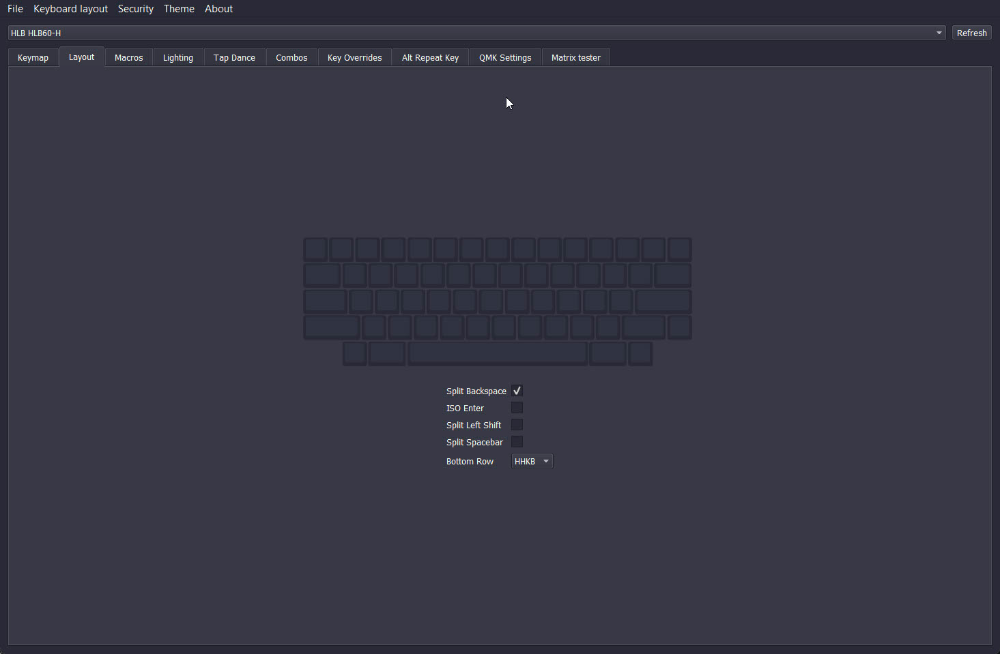
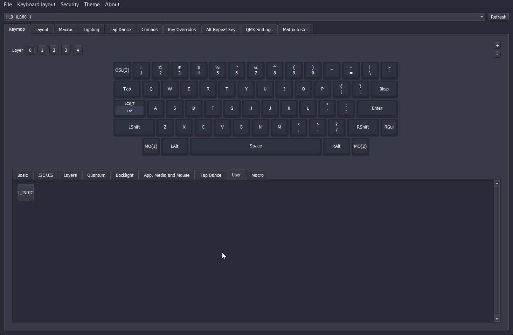
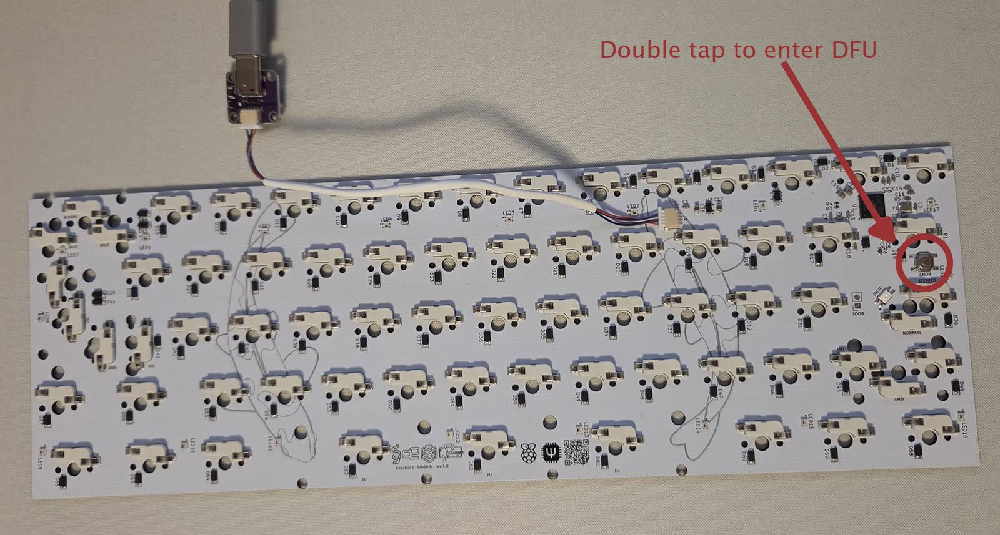
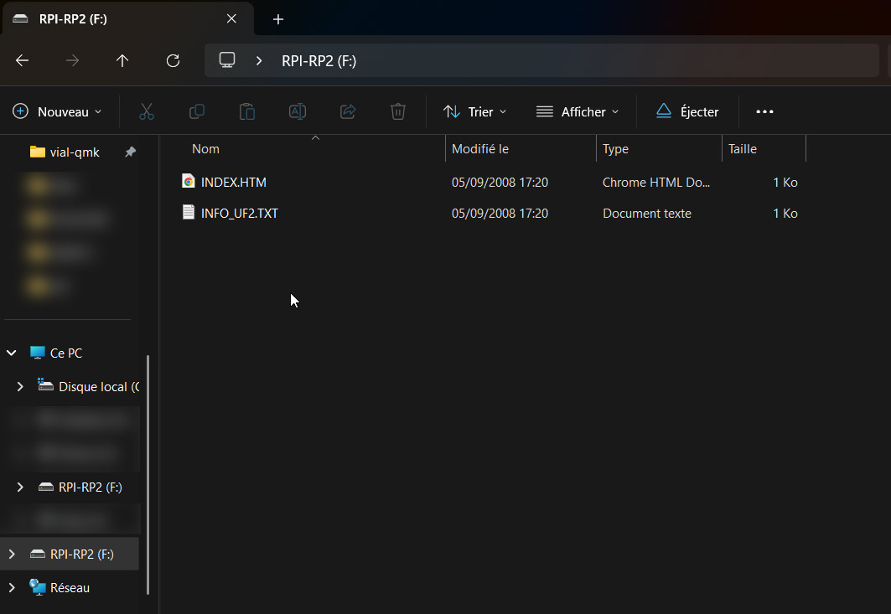

# HLB Projects
Welcome to HLB projects documentation GitHub repository !

## Projects (descending order)
### 2025 - PoorKoi 2
*60% CNC keyboard in Polycarbonate / Aluminium* : [Project Repository](https://github.com/H3lli0n/PoorKoi2)
### 2024 - CantorMX
*42/36% Split Keyboard with open source 3DP case* : [Project Repository](https://github.com/H3lli0n/CantorMx-3DP-case)
### 2024 - PoorKoi 1
*60% stacked acrylic keyboard* : [Project Repository](https://github.com/H3lli0n/PoorKoi)
## PCB documentation

### HLB60
#### Description
- 60% ANSI / ISO
  - Hotswap *HLB60-H* or Solder *HLB60-S*
- RP2040 MCU
- Split backspace / Split left shift / Split right shift / Split spacebar (3U/1U/3U)
  - Long shift on solder version
  - 10U spacebar with 8U wire on solder version
- Tsangan bottom row
- Underglow RGB
- Capslock/Layers indicator
- QMK / VIAL firware
  - RGB management under my userspace

#### RGB Management
Firmware is made with QMK Rgb Matrix implementation. You have all effects available as well as *Direct Control* mode.
Direct Control mode allow you to have all leds OFF but capslock/layers indicator on. Capslock indicator is always ON.

Layers indicator is OFF by default and you can toggle the feature using the custom keycode *L_INDIC*. Add it to your keymap and press key to activate or deactivate. A white blinking led will notify you on change.

#### Flashing
HLB60-H (hotswap) and HLB60-S (solder) vial firmware can be found here: [VIAL Releases](https://github.com/H3lli0n/vial-qmk/releases?q=hlb60&expanded=true)
##### PCB not flashed by pcb manufacturer
When not flashed keyboard will be automatically in DFU mode when plugged on computer.
##### Flashed and want to upgrade to newer version
Enter DFU mode by pressing escape and plugin keyboard or press twice on reset physical button on the back of pcb.

##### Install firmware
A usb drive will be open on Windows or listed in windows explorer. Simply copy paste the .UF2 file downloaded accordingly to the pcb version. Keyboard will reboot itself.
