This project open-source, all files to order a batch of pcb-a are free to use. This project is also sponsored by PCBWay.

PCBWay is an online service to manufacture pcb/pcb-a (pcb with assembly which means all components soldered).

If you need their services please use the following link to support the team ! https://pcbway.com/g/4Gd3AJ

# Description
- 40% ANSI / ISO
  - Hotswap *HLB40-H*
    - STM32F MCU
    - Capslock/Layers indicator
  - EC (Electro Capacitive) *HLB40-EC*
    - STM32F MCU
- Bottom row
  - 6U
  - 2.75U/1U/2.25U
- QMK / VIAL firware
  - RGB management under my userspace (HLB40-H)

# Layout

# Files
## HLB40-H
*Files will be available once tested*
## HLB40-EC
*Files will be available once tested*

# How to order
Ordering pcb through PCBWay is straightforward but you can be lost at some steps so we will guide you along the process.

## Files
Once you downloaded the pcb version you want, unzip the archive into a folder. You shall have those files
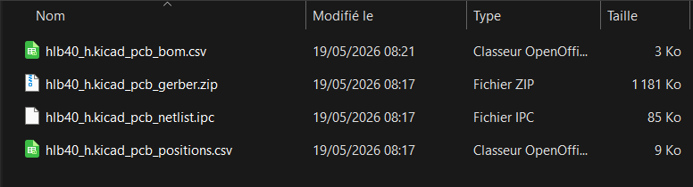
- *hlb40_h.kicad_pcb_gerber.zip*: the main file containing all pcb data, layers, routes... Everything the service needs to fill data form
- *hlb40_h.kicad_pcb_bom.csv*: listing of all components to assemble onto the pcb - each component is identified by a code and the service knows exactly what to order
- *hlb40_h.kicad_pcb_positions.csv*: positions of each component on the pcb for assembly

### Hotswap socket colors
Hotswap sockets from Kailh brand are hard to find with online services. We are forced to use a generic brand but after many tests they are fine. They come in 3 colors (white/black/purple) and the global stock is also depending of the global economic context.
In the BOM .csv file you can open with notepad you'll find them with `Value = Keyswitch`

Look at the column `LCSC` and you'll find a code you change depending on the wanted color and the global stock:
- Purple = C41430893
- White = C49352235
- Black (Kailh) = C5156480

## Creating PCBWay account
The next step is to create an account on PCBWay by following our affiliated link https://pcbway.com/g/4Gd3AJ - once your account created you will receive later a $5 coupon.

## Requesting a quote
Now it's time to order by uploading all files and selecting the right options. One key factor of the final price is the quantity, the more you order the less you pay.
For this example we will order 5 pcb (the board with copper layers) and request 5 assemblies (components soldered on the pcb).

### PCB Quote menu
Before the assembly we have to quote the pcb itself, to do so click on *PCB Instant Quote*

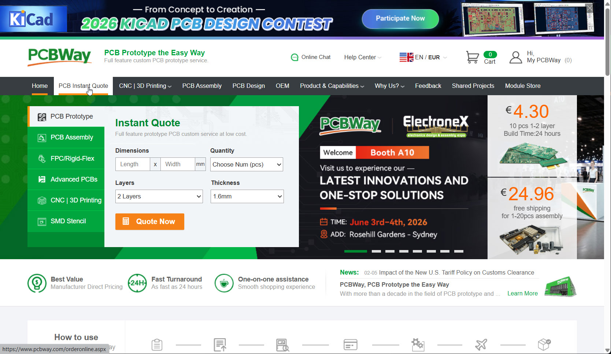
And *Quick Order*

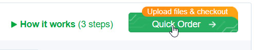

Where you can upload the Gerber file from our archive as listed before.
Our PCB is composed of 4 layers so you have to specify their order:
- L1 : F.Cu
- L2 : In1.Cu
- L3 : In2.Cu
- L4 : B.Cu
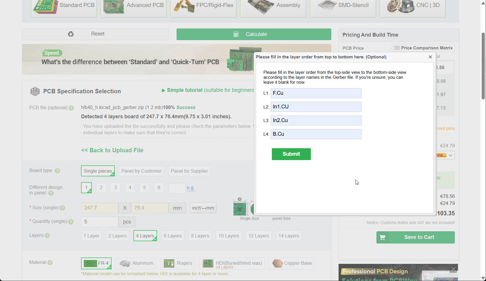

You can even have a look on the PCB preview with their *Gerber Online Viewer*
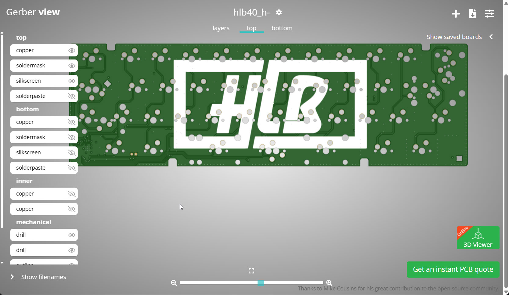

### Ordering options
#### Quantity
Now we have to check the options and modify some items. As described before, the final price of the order is quantity dependant because manufacturing few items requires the same technical effort than on a large batch. This human cost is divided over the number of item purchased.

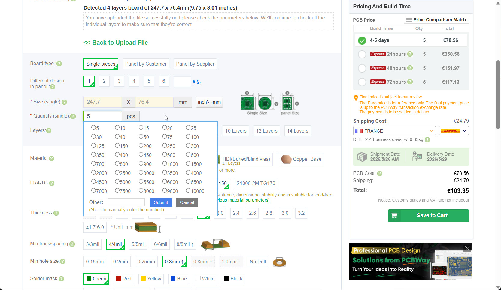
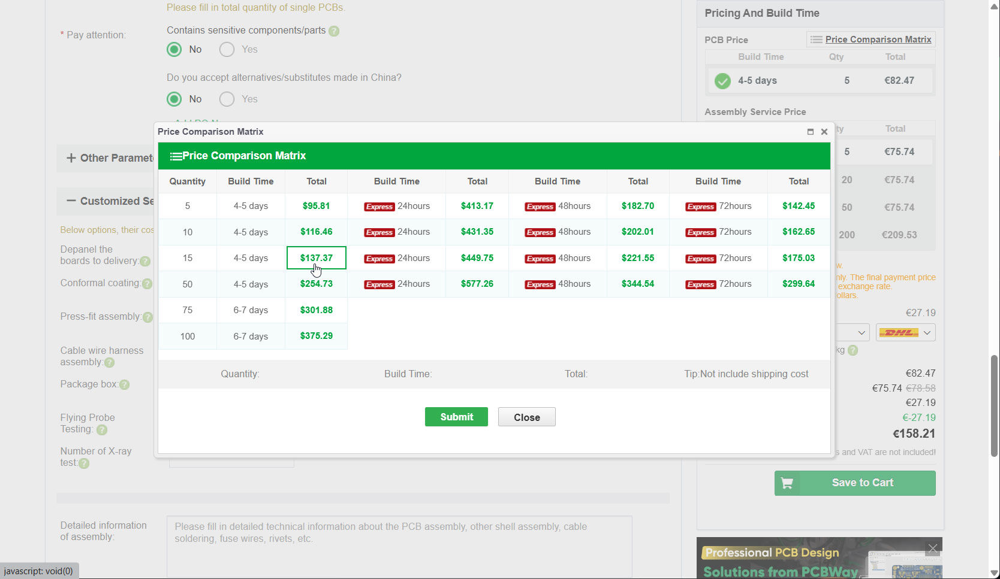

Don't hesitate to make an announcement on our discord maybe you'll find people interested in this order and split the cost.
Also be aware that it might be expensive but PCBWay services does a lot of reviews on the order to avoid mistakes.

#### Good looking PCB
Our PCB is 1.6mm thickness and you can custom its color through *Solder mask* option. Here we select a red one (we will type faster for sure!)
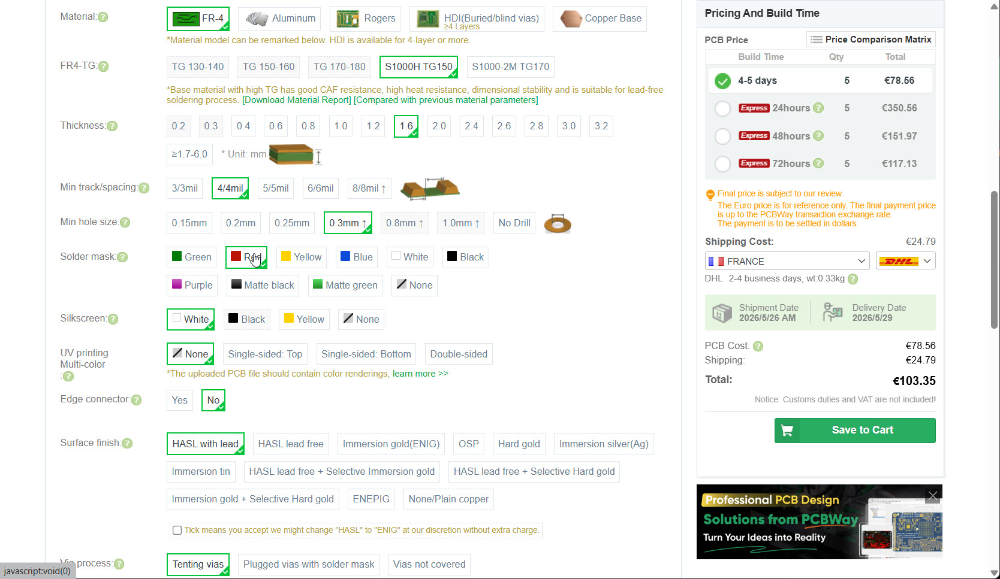

#### Soldering option
Since we live in Europe and we are "eco friendly" please avoid lead that is now banned from our continent.
Thanks to select *HASL lead free* meaning soldering is made from silver paste.
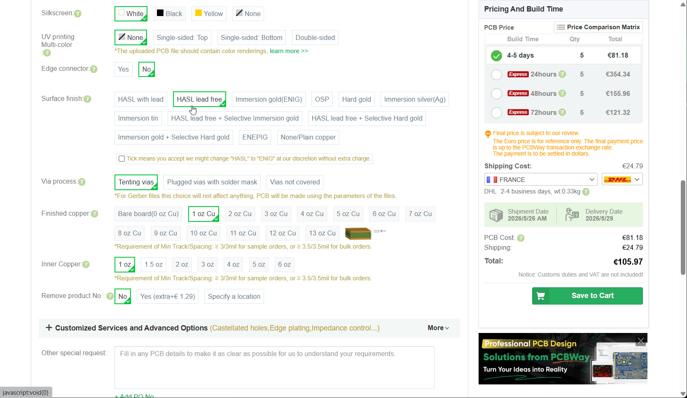

Note: for solder PCB (not hotswap) you shall select ENIG based option to have strong switches pads.

By default a serial number will be printed on the pcb. You can remove this printing with the option below.
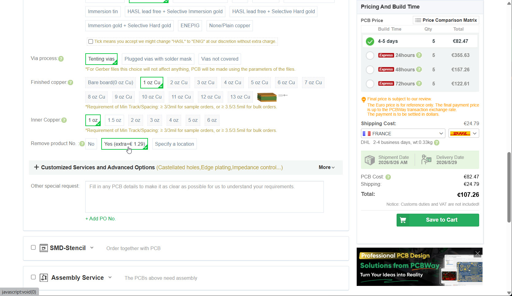

#### Assembly
Now we are enabling the assembly part of the order. With this step each electronic component will be ordered and soldered. This step is mandatory.
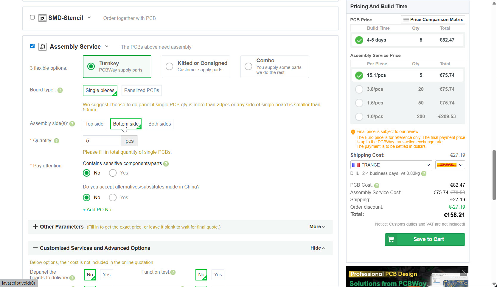
You just have to click on *Bottom side* meaning all our components will be soldered on the back.

#### Custom options
This option is not essential but will save some space in the box and avoid to cut soldering panels needed for machines to slide pcb. This option doesn't add much on the final cost.
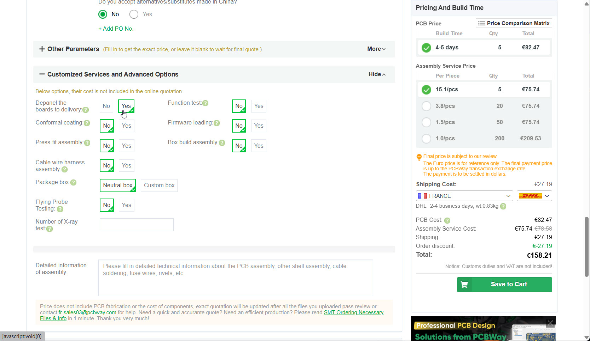

When done you just have to click on *Save to Cart*
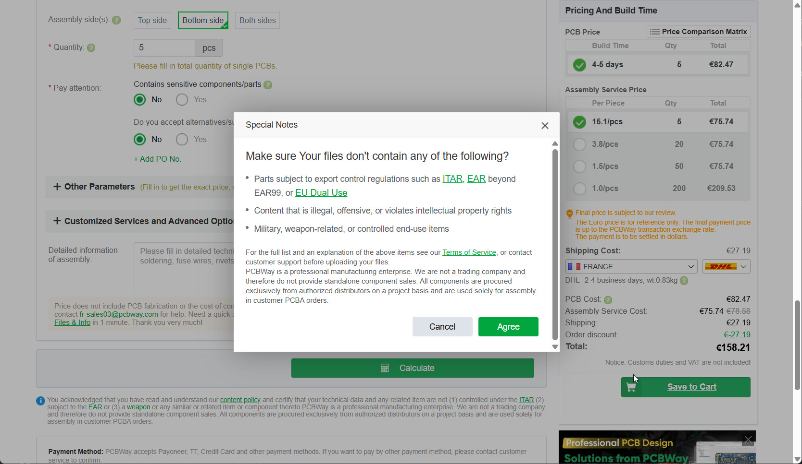

### Cart
We are almost at the end with two orders in our cart, one for pcb manufacturing and one for assembly.

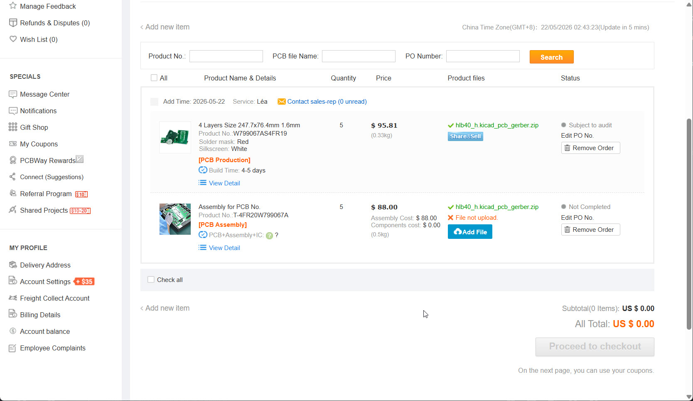

As you can see, we have files to upload for the assembly, the two remaining described `.csv` files earlier.
One for position (*Upload Centroid file* in the form) and one for the list of components (*Parts Lists (BOM) upload*).

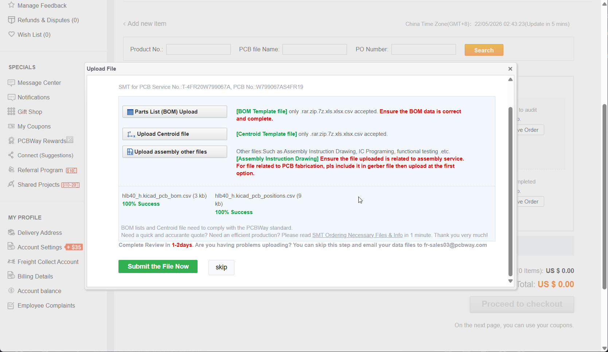

And we are done you can submit your cart that will be reviewed.

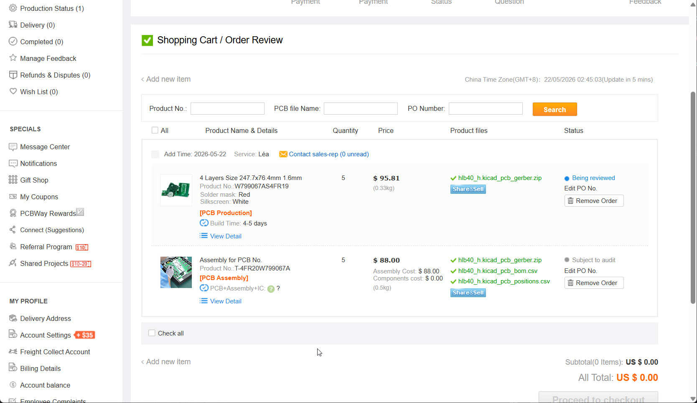

You don't have any extra step to manage, your commercial contact and the whole PCBWay team will manage your uploaded files and solder everything at the correct positions. This is done by the footprints used and all the mandatory marks on the pcb.